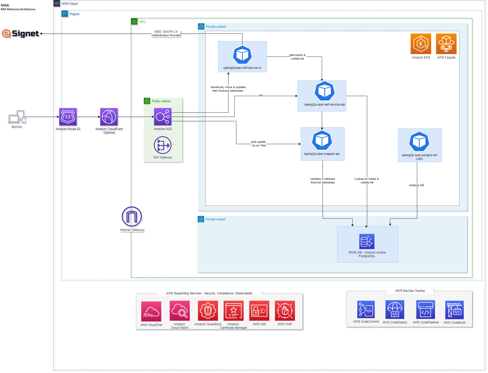

# SPAR, one-click deployment on AWS

### Description
The Social Payments Account Registry (SPAR) is an extension of the ID Account Mapper that maintains a mapping of a user ID and Financial Address (FA) like bank code, account details, mobile wallet number, etc., primarily aimed at cash transfers in a social benefit delivery system. It is an independent module offered by OpenG2P. SPAR implements the functionality of an ID Account Mapper with the additional feature of offering a self-service portal for a beneficiary to add/update his/her FA. To learn more about SPAR, please visit [https://docs.openg2p.org/social-payments-account-registry-spar](https://docs.openg2p.org/social-payments-account-registry-spar/).

### Packaging overview
This packaging initiative offers a practical approach to increase the adoption, streamline deployment and management of SPAR building blocks on AWS by providing a reference architecture and one-click deployment automation scripts. It allows builders to manage AWS resource provisioning and application deployment in a programmatic and repeatable way.

This repository contains the source code and configuration for deploying SPAR stack that leverages the power of Amazon Web Services (AWS) **[Cloud Development Kit (CDK)](https://aws.amazon.com/cdk)** for infrastructure provisioning and **[Helm](https://helm.sh)** for deploying services within an Amazon Elastic Kubernetes Service (EKS) cluster.  

### SPAR Deployment
The SPAR one-click deployment packaging offers two mode of deployments on the AWS cloud, catering to different deployment scenarios.

#### Mode One: AWS CDK + Helm
This mode offers a comprehensive solution for users who prefer a one-click deployment approach to provisioning AWS infrastructure and deploying the SPAR application stack.

* [AWS CDK One Click Deployment](documentation/01-Deployment-CDK-Spar.md)

#### Mode Two: Direct Helm Chart Invocation
An alternative deployment approach accommodates users with existing essential AWS infrastructure components like Amazon RDS Postgres and an Amazon EKS cluster. This mode enables the direct installation of the SPAR Helm chart without relying on AWS CDK scripts. Alternatively, you can combine both methods, utilizing CDK for provisioning specific services like the EKS cluster.

* [Helm Chart Deployment](documentation/02-Deployment-Helm-Spar.md)

### SPAR reference architecture
Required AWS services to operate the core Sunbird RC registry services:
* Amazon VPC
* Amazon RDS for PostgreSQL Serverless V2
* Amazon Elastic Kubernetes Service (Amazon EKS)
* AWS Fargate
* Elastic Load Balancing (ELB)

Auxiliary components (ideal for production-grade deployments):
* Amazon ElastiCache Redis Engine
* 
