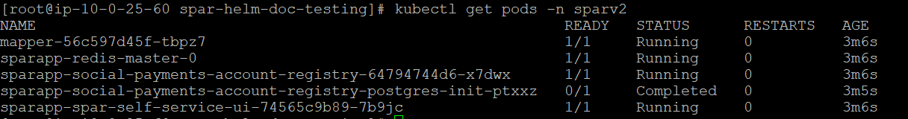
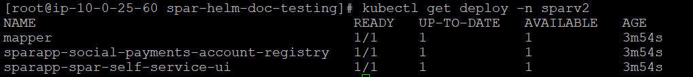
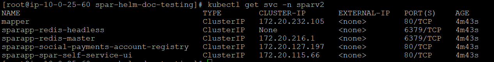

# Spar Services Helm Chart

This Helm chart provides a convenient way to deploy the SPAR services, which includes various microservices and components. 


## Prerequisites

Before deploying this Helm chart, ensure you have the following prerequisites in place:

1. [Git](https://git-scm.com/)
2. [Helm](https://helm.sh/) (installed on your local machine)
3. [Kubectl](https://kubernetes.io/docs/tasks/tools/install-kubectl/) (installed on your local machine)
4. Access to a Kubernetes cluster

## Deploying the Spar Services

#### 1. Intialized Spar Helm Repository
```
helm repo add spar https://venkates67.github.io/spar-aws
```

#### 2. Check the Helm Repo Status:
```
helm repo list
```

#### 3. Serach for Spar Chat in Helm Repo:
```
helm search repo spar
```
```
helm search repo spar
NAME                    CHART VERSION   APP VERSION     DESCRIPTION
spar/social-payments-account-registry            0.1.0   0.1.0           A Helm chart for Social Payments Account Registry
```

#### 4. Helm Chart Spar Framework Deployment Requires following User Inputs:
   
   #### Global deployment properties:  
    
   | Values.yaml parameter Name                     | Value   | Description                         |
   | ---------------------------------------------  | ------- | ----------------------------------- |
   | SPAR_CORE_DB_HOSTNAME                          | XXXXYY  | RDS/Data Host Address               |
   | SPAR_CORE_DB_PASSWORD                          | XXXXYY  | Database Password                   |
   | SPAR_CORE_DB_USERNAME                          | XXXXYY  | Database User Name                  |
   | SPAR_CORE_AUTH_DEFAULT_ISSUERS                 | XXXXYY  | eSignet Authentication Issuer URL   |                    
   | SPAR_CORE_AUTH_DEFAULT_JWKS_URLS               | XXXXYY  | eSignet JWKS URL                    |
   
   #### Deployment properties specific to G2P Connect mapper:  

   | Values.yaml parameter Name                     | Value   | Description                         |
   | ---------------------------------------------  | ------- | ----------------------------------- |
   | SPAR_G2PCONNECT_MAPPER_DB_HOSTNAME             | XXXXYY  | RDS/Data Host Address               |


#### List of Micro Service Container Images:

| Pod Name                          | ImageLocation                            | Tag     |
|-----------------------------------|------------------------------------------|---------|
| social-payments-account-registry  | openg2p/social-payments-account-registry | develop |
| spar-g2pconnect-id-mapper         | openg2p/spar-g2pconnect-id-mapper        | develop |
| spar-self-service-ui              | openg2p/spar-self-service-ui             | develop-no-runtime-build |
| postgresInit                      | jbergknoff/postgresql-client             | develop |


#### Ingress requirements for the below services. 

| Service Name                                    |         Type                  | Path     |            Protocol/port      |
|-------------------------------------------------|-------------------------------|-----------|---------------------|
| [RELEASE_NAME]-social-payments-account-registry  | API  | /spar/v1/* |http/80|
| [RELEASE_NAME]-mapper                            | API       | /mapper/v1/* |http/80|
| [RELEASE_NAME]-spar-self-service-ui              | UI             | /selfservice | http/80|

By default Ingress is enabled for all the services listed above, with required annotations to create a AWS Internet facing ALB exposing the services.


#### 5. Extract the helm repo:
```

helm pull spar/social-payments-account-registry --untar --destination .

```   
#### 6. Install or Upgrade the SPAR Framework via Helm Chart:
```
helm upgrade --install <RELEASE_NAME> social-payments-account-registry/ -n <NAMESPACE> --set envVars.SPAR_CORE_DB_HOSTNAME="<DB_HOSTNAME>" --set sparg2pconnectidmapper.envVars.SPAR_G2PCONNECT_MAPPER_DB_HOSTNAME="<DB_HOSTNAME>"  --set envVars.SPAR_CORE_DB_USERNAME="<DB_USERNAME>" --set envVars.SPAR_CORE_DB_PASSWORD="<DB_PASSWORD>"
```
Replace with relevant values for your release.


#### 7. After deployment, verify if the postgre-init of sparDB is COMPLETED and rest of the pods are in RUNNING state
```bash
kubectl get pods
```



```bash
kubectl get deploy
```


```bash
kubectl get svc
```


```bash
helm list
```

## Upgrading the Helm Release

If you need to update or make changes to the services, you can upgrade the Helm release by following these steps:

#### 1. if you want you can create a input values.yaml file instead of supplies --set paramters during the commandline.
```
helm upgrade <RELEASE_NAME> . -f values.yaml
```

or 

#### 2. Upgrade the Helm release:

```bash
helm upgrade --install <RELEASE_NAME> social-payments-account-registry/ -n <NAMESPACE> --set envVars.SPAR_CORE_DB_HOSTNAME="<DB_HOSTNAME>" --set sparg2pconnectidmapper.envVars.SPAR_G2PCONNECT_MAPPER_DB_HOSTNAME="<DB_HOSTNAME>"  --set envVars.SPAR_CORE_DB_USERNAME="<DB_USERNAME>" --set envVars.SPAR_CORE_DB_PASSWORD="<DB_PASSWORD>"
```
    
### Rollback a Release

In case of issues, you can roll back to a previous release:
```
helm rollback <RELEASE_NAME> <REVISION_NUMBER>
```

### Verify Rollback

After executing the rollback command, you can use helm history to confirm that the rollback was successful:
```
helm history <RELEASE_NAME>
```

### Uninstalling the Helm Release

To uninstall and remove all resources associated with the Helm release:

```
helm uninstall <RELEASE_NAME>
```

   
