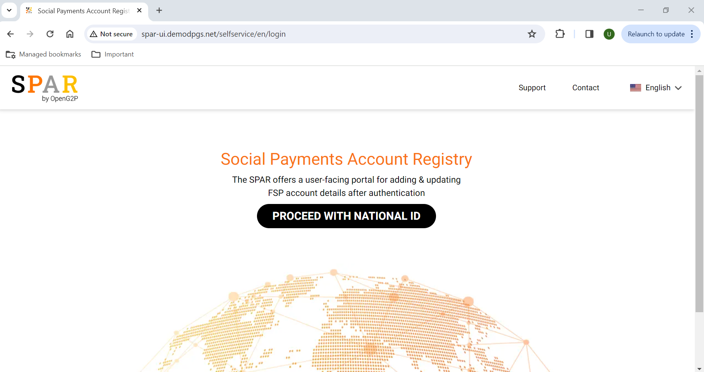
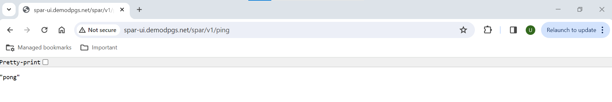
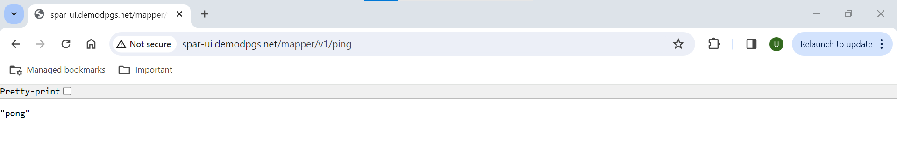

# Post Installation Configuartion steps

## Project Setup and Configuration

This README provides instructions to 
- Validate the SPAR application. 
- Configure SPAR self service instance to enable National ID based OIDC auth mechanism.

### Steps to verify SPAR application Health status

- SPAR Self Service portal will be accessible at http://<SPAR_HOSTNAME>/selfservice. SPAR_HOSTNAME could be the AWS ALB DNS or could be a Route53 domain A record pointing to the AWS ALB.

 

- SPAR API's would be exposed at http://<SPAR_HOSTNAME>/spar/v1. ping test to endpoint http://<SPAR_HOSTNAME>/spar/v1/ping should return "pong".

 

- Mapper API's would be exposed at http://<SPAR_HOSTNAME>/mapper/v1. ping test to endpoint http://<SPAR_HOSTNAME>/mapper/v1/ping should return "pong".

 

- [Optional] SPAR API features exposed could be verified by uploading sample data via Python Script. Refer [OpenG2P SPAR Admin Guide](https://docs.openg2p.org/social-payments-account-registry-spar/user-guides/admin-guide-to-link-id-with-financial-address-information) for more details.

### Configure Self Service Portal for OIDC auth

Refer [Onboard SPAR on esignet](https://docs.openg2p.org/social-payments-account-registry-spar/deployment#onboard-spar-on-esignet)

By default, the deployed instance of SPAR will be pointing collab instance of esignet [esignet-sollab](https://docs.esignet.io/try-it-out/integrate-with-e-signet)

**NOTE** Below steps are applicable only for integrating with esignet collab instance.

- Request the esignet collab team to assist in creating a OIDC client for the deployed instance of SPAR

- Once we receive the OIDC client for SPAR update the same as detailed in [Post Installation Guide](https://docs.openg2p.org/social-payments-account-registry-spar/deployment#post-installation)

Edit the spardb table login_provider to incopoarte the retreived authorization_parameters.

~~~sql
UPDATE login_providers
SET    authorization_parameters =
'{"authorize_endpoint":" https://esignet.collab.mosip.net/authorize","token_endpoint":"https://esignet.collab.mosip.net/v1/esignet/oauth/v2/token","validate_endpoint":"https://esignet.collab.mosip.net/v1/esignet/oidc/userinfo","jwks_endpoint":"https://esignet.collab.mosip.net/v1/esignet/oauth/.well-known/jwks.json","client_id":"veb9HtGS6nvVmTch9wPEBVfzWHT3XpmHc7G68xrK4Kc","client_assertion_type":"urn:ietf:params:oauth:client-assertion-type:jwt-bearer","client_assertion_jwk":{"p":"37osgnT2cfcwjwTTnpEgTbQen54-Vmhqkm18PmUldnKy6RpI4sbKO3pwFXOEaUdAzAda9MWZa7RNH0iXAVPGvQ_o9NMeBrAB-iuEQv3eoJqPt1E-bI2Yw2i-z5vd8kKXtyVEScVQ-wOedZsKhXooOAgDLFlOwlsTmKtr0UKf8XM","kty":"RSA","q":"pcMVm99ZIameVtNDX0qkG1VYu4i56hLIW6naw5gwNxbne7578_IQ--mdR_JQXvbc5JVefejquunSv_mvb19I7tPNMK5sk2RAdwscFH9SIxki9xErxTs8nnbR3gzukY6g7b0hus1KZU9EZjU-1O7EmcqUbUA9szvKxbxhEolv6Vk","d":"LjvB2txpAMJ6HhIJ9Gt4aKuBd0x392Gj7DlYJ2oD8AtxyspD4QGiFOf_56JvkRPLkZR6SeekLTR6gj-IGbLV7cDxmx1Qf4TKejYa9DZlryPLfzwU3abJEjThWmD2ILvmjPFWBW2_MPhfPlvF7UEv1fB-NT-gayx4IQVuxh4NFkmxdoXdqk7DsLgCXuI_fjek7s5nIeK0pifxC2m3Pm7g2P12_mAD6JkL78dWVFyA-rzA_BjvZkGMjxj3P0YRN8oEnP36ASGBv5uKovPPOtinwwYGk-fzstmCLkQT_l1yYpwQIpyDpdWtemR53zb95rMd_GPbwRWuy30bV5UVPbsFwQ","e":"AQAB","use":"sig","qi":"gUS3Jj3-pkZmN5EJI0QDHEjtYU1f6NlfdBnIDaImWJon3IK3g8y09SEo7k9FckzUjksGyVAJ0aoBkrfui6hkkVPJ9oCqVGhpvUkWLvTdSWD09fddpD6M_aG9Lh9RZE11phjbX8dqMGYLgjFQF9O16VNbzpoGX5pnGyYfsWlYlPc","dp":"1r7jHk2aiIXWjFD7t4Zh1XQAuQGxoEsVkHua-GEp9mneJTVfpJ1fXHwHve9lt4_3OGAPBEfvHZyxMkgA-fsqFiuBVg6XEaA8JZ9DkvIPkWUKcdF_875uVZLjJG_eOD2HVvpkc9L8ChTNMuGg1cINfMrkENugZ5n4U2CnWvNyhtU","alg":"RS256","dq":"U5AK_q8TccLeTYrm9czc-eKGftOoVXXuhzcTT3MTK1Jik6EtP4cSRMw6O6DOH3F3Xcxm_DZEzsE9OwYWCKESVUN0t0vW9F6fmOOC3lpo_8SWOdLwK9d28bOYjMYcJkium-qybEc9b-EL7DJ_YDyV46maNZEjCY3k5NXYYc3jGtE","n":"kN18YntSp6yDaMV-7bUOTCDT7GRBpoZhZlZRLmO4Dq4EradexfRix2Ghs_LFidtvvQbBKtyUf8mnReM92ULrsJOmELr3AIFe6rXkaoxvGpomtrSCJp-WKl9QuOSKeSVxpCdl9r6AjByYDBSdXNyqdcvcn_emDMnxLx3QEJtVSd5E0ZqvcTN_18i3z26Oodb0cxvgtmOyOHoOTCZs3bvkkHxI49I7b4eBU72KYuEizh80RR0SIIzmWBWrK7jDN0llxRh9hWcxFBRZ_S4NWb5h1N0-vEiBt8MVsTrVinZ01j6zEN4KefLObjp_CPDy-51rJvgMas_GVcDuTPoJ-Dmb-w"},"response_type":"code","scope":"openid profile email","redirect_uri":" http://spar-ui.demodpgs.net/spar/v1/oauth2/callback","code_verifier":"_cHemmb3ZJIeSNj7ND1agM-G4HgmenFxPp3l-vnRKDU","extra_authorize_parameters":{"acr_values":"mosip:idp:acr:generated-code mosip:idp:acr:biometrics mosip:idp:acr:linked-wallet","claims":"{\"userinfo\":{\"name\":{\"essential\":true},\"phone_number\":{\"essential\":false},\"email\":{\"essential\":false},\"gender\":{\"essential\":true},\"birthdate\":{\"essential\":true},\"address\":{\"essential\":false},\"picture\":{\"essential\":false}},\"id_token\":{}}"}}'
WHERE  id = 1; 

~~~

### Access self service portal and ensure Nationa ID based OIDC mechanism is working.
